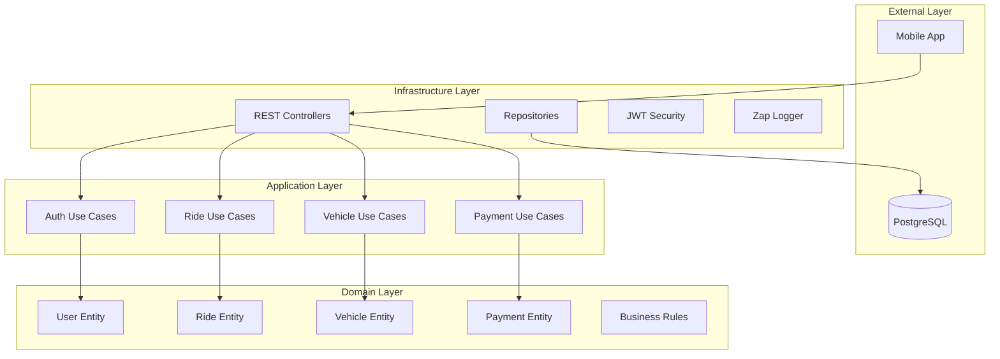
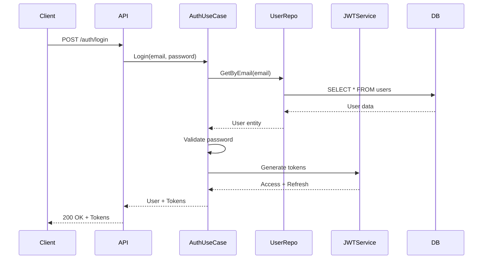

# Ride Hailing Backend - Clean Architecture

[](https://golang.org)
[](LICENSE)
[](https://www.docker.com/)
[](https://www.postgresql.org/)

A production-ready ride-hailing backend API built with Go, implementing Clean Architecture principles. This project provides complete CRUD operations for a ride-hailing mobile application with user management, vehicle tracking, ride matching, and payment processing.

## 🏗️ Architecture Overview

This project strictly follows **Clean Architecture** principles with clear separation of concerns:



### Dependency Flow

**Dependencies point inward**: Infrastructure → Application → Domain

- **Domain Layer**: Contains business entities and rules (100% independent)
- **Application Layer**: Contains use cases and business logic
- **Infrastructure Layer**: Contains frameworks, databases, and external services

## 🚀 Quick Start

### Prerequisites

- Go 1.24.2+
- Docker & Docker Compose
- Make (optional, for convenience)

### Installation & Running

```bash
# Clone the repository
git clone https://github.com/yourusername/microservices-go-ride
cd microservices-go-ride

# Create .env file from example
cp .env.example .env

# Start all services with Docker Compose
make run
# OR
docker-compose up --build -d
```

### Verify Installation

```bash
# Check service status
make status

# Expected output:
# - API: http://localhost:8080
# - Adminer (DB UI): http://localhost:8081
# - PostgreSQL: localhost:5433
```

### Test the API

```bash
# Health check
curl http://localhost:8080/v1/user/

# Should return user list or empty array
```

## 📋 Features

### Core Features

- ✅ **User Management**: Riders, Drivers, and Admin roles
- ✅ **Vehicle Management**: CRUD for driver vehicles
- ✅ **Ride Management**: Create, match, track, and complete rides
- ✅ **Payment Processing**: Payment tracking and status management
- ✅ **JWT Authentication**: Secure token-based auth with refresh tokens
- ✅ **Role-Based Access Control**: Different permissions for riders, drivers, admins
- ✅ **Search & Pagination**: Advanced filtering and pagination
- ✅ **Structured Logging**: Zap logger with correlation IDs

### Technical Stack

| Component | Technology |
|-----------|-----------|
| Language | Go 1.24+ |
| Framework | Gin-Gonic |
| ORM | GORM |
| Database | PostgreSQL 17.4 |
| Auth | JWT (Access + Refresh) |
| Logger | Zap |
| Container | Docker Compose |
| Testing | Go test + Cucumber |

## 🗂️ Project Structure

```
microservices-go-ride/
├── src/
│   ├── domain/                 # 🎯 Domain Layer
│   │   ├── user/              # User entity
│   │   ├── vehicle/           # Vehicle entity
│   │   ├── ride/              # Ride entity
│   │   ├── payment/           # Payment entity
│   │   └── errors/            # Domain errors
│   │
│   ├── application/            # 📋 Application Layer
│   │   └── usecases/
│   │       ├── auth/          # Authentication logic
│   │       ├── user/          # User management
│   │       ├── vehicle/       # Vehicle management
│   │       ├── ride/          # Ride management
│   │       └── payment/       # Payment processing
│   │
│   └── infrastructure/         # 🔧 Infrastructure Layer
│       ├── di/                # Dependency Injection
│       ├── repository/        # Data Access Layer
│       │   └── psql/          # PostgreSQL repos
│       ├── rest/              # HTTP Layer
│       │   ├── controllers/   # REST Controllers
│       │   ├── middlewares/   # HTTP Middlewares
│       │   └── routes/        # Route definitions
│       ├── security/          # JWT & Security
│       └── logger/            # Structured Logging
│
├── Test/
│   └── integration/           # Integration Tests
│
├── docs/                      # Documentation
├── docker-compose.yml         # Docker Compose config
├── Dockerfile                 # Multi-stage Docker build
├── Makefile                   # Development commands
└── main.go                    # Application entry point
```

## 🔧 Development Commands

### Using Makefile (Recommended)

```bash
# Show all available commands
make help

# Build Docker images
make build

# Start all services
make run

# Stop all services
make stop

# View logs
make logs

# Run tests
make test

# Run tests with coverage
make coverage

# Database shell
make db-shell

# Clean up everything
make clean
```

### Manual Commands

```bash
# Build and start
docker-compose up --build -d

# Stop services
docker-compose down

# View logs
docker-compose logs -f api

# Run tests locally
go test ./...

# Run with coverage
go test -coverprofile=coverage.out ./...
go tool cover -html=coverage.out
```

## 📊 API Endpoints

### Authentication

| Method | Endpoint | Description |
|--------|----------|-------------|
| POST | `/v1/auth/login` | User login |
| POST | `/v1/auth/access-token` | Refresh access token |

### Users

| Method | Endpoint | Description | Auth Required |
|--------|----------|-------------|---------------|
| GET | `/v1/user` | List all users | ✅ |
| POST | `/v1/user` | Create user | ✅ Admin |
| GET | `/v1/user/:id` | Get user by ID | ✅ |
| PUT | `/v1/user/:id` | Update user | ✅ |
| DELETE | `/v1/user/:id` | Delete user | ✅ Admin |
| GET | `/v1/user/search` | Search users | ✅ |

### Vehicles (Coming in Phase 4)

| Method | Endpoint | Description | Auth Required |
|--------|----------|-------------|---------------|
| GET | `/v1/vehicle` | List vehicles | ✅ |
| POST | `/v1/vehicle` | Add vehicle | ✅ Driver |
| GET | `/v1/vehicle/:id` | Get vehicle | ✅ |
| PUT | `/v1/vehicle/:id` | Update vehicle | ✅ Driver |
| DELETE | `/v1/vehicle/:id` | Delete vehicle | ✅ Driver |

### Rides (Coming in Phase 4)

| Method | Endpoint | Description | Auth Required |
|--------|----------|-------------|---------------|
| GET | `/v1/ride` | List rides | ✅ |
| POST | `/v1/ride` | Create ride | ✅ Rider |
| GET | `/v1/ride/:id` | Get ride details | ✅ |
| PUT | `/v1/ride/:id/status` | Update ride status | ✅ Driver |
| POST | `/v1/ride/:id/match` | Match driver | ✅ System |

### Payments (Coming in Phase 4)

| Method | Endpoint | Description | Auth Required |
|--------|----------|-------------|---------------|
| GET | `/v1/payment` | List payments | ✅ |
| POST | `/v1/payment` | Create payment | ✅ |
| GET | `/v1/payment/:id` | Get payment | ✅ |

## 🔐 Authentication Flow



## 🧪 Testing

```bash
# Run all tests
make test

# Run tests with coverage
make coverage

# Run integration tests
make test-integration

# Expected coverage: ≥80%
```

### Test Structure

- **Unit Tests**: Test individual functions and use cases
- **Integration Tests**: Test complete flows with real database
- **Acceptance Tests**: Cucumber BDD tests

## 🔒 Security Features

- ✅ JWT Authentication (Access + Refresh tokens)
- ✅ Password hashing with bcrypt
- ✅ Role-based access control (RBAC)
- ✅ CORS configuration
- ✅ Input validation and sanitization
- ✅ SQL injection prevention (via GORM)
- ✅ Secure headers (XSS protection, CSP)

## 📈 Database Schema

### Main Tables

- **users**: User accounts (riders, drivers, admins)
- **vehicles**: Driver vehicles
- **rides**: Ride requests and history
- **payments**: Payment transactions
- **refresh_tokens**: JWT refresh tokens

See `docs/DATABASE_SCHEMA.md` (coming in Phase 5) for complete schema documentation.

## 🐳 Docker Services

| Service | Port | Description |
|---------|------|-------------|
| **api** | 8080 | Main API service |
| **db** | 5433 | PostgreSQL database |
| **adminer** | 8081 | Database management UI |

### Adminer Access

- URL: http://localhost:8081
- System: PostgreSQL
- Server: db
- Username: postgres
- Password: (from .env file)
- Database: ride_hailing_db

## 📚 Documentation

- [Clean Architecture Guide](docs/README_CLEAN_ARCHITECTURE.md)
- [API Documentation](docs/API_DOCUMENTATION.md)
- [Search Endpoints](docs/SEARCH_ENDPOINTS.md)
- [Deployment Guide](docs/DEPLOYMENT_GUIDE.md)

## 🚧 Development Roadmap

### ✅ Phase 1: Infrastructure & Docker (COMPLETED)
- Docker Compose setup
- Environment configuration
- Makefile commands

### 🔄 Phase 2: Domain Layer (IN PROGRESS)
- User, Vehicle, Ride, Payment entities
- Business rules and enums
- Domain tests

### ⏳ Phase 3: Application Layer (PENDING)
- Use cases for all entities
- Business logic implementation
- Use case tests

### ⏳ Phase 4: Infrastructure - API (PENDING)
- Repositories for all entities
- REST controllers
- Route configuration
- Middleware integration

### ⏳ Phase 5: Database & Migrations (PENDING)
- Migration files
- Seed data
- Index optimization

### ⏳ Phase 6: Testing & CI/CD (PENDING)
- Complete test coverage
- GitHub Actions workflow
- Test automation

### ⏳ Phase 7: Documentation (PENDING)
- Developer guide
- API specifications
- Deployment documentation

## 🤝 Contributing

We welcome contributions! Please see [CONTRIBUTING.md](CONTRIBUTING.md) for details.

### Development Guidelines

- Follow Clean Architecture principles
- Write tests for new features (≥80% coverage)
- Use conventional commit messages
- Update documentation for API changes
- Never import from infrastructure in domain layer

## 📄 Environment Variables

```bash
# Application
APP_ENV=development
SERVER_PORT=8080

# Database
DB_HOST=db
DB_PORT=5432
DB_NAME=ride_hailing_db
DB_USER=postgres
DB_PASSWORD=your_password

# JWT
JWT_ACCESS_SECRET_KEY=your_access_secret
JWT_REFRESH_SECRET_KEY=your_refresh_secret
JWT_ACCESS_TIME_MINUTE=60
JWT_REFRESH_TIME_HOUR=168

# Initial Admin
START_USER_EMAIL=admin@ridehailing.com
START_USER_PW=Admin@123
```

## 🔄 Changelog

### v1.0.0 (Phase 1 - Current)
- ✅ Docker Compose setup with API, PostgreSQL, Adminer
- ✅ Environment configuration
- ✅ Makefile with development commands
- ✅ Clean Architecture foundation
- ✅ JWT authentication (from base project)
- ✅ User management (from base project)

### v2.0.0 (Planned)
- ⏳ Complete ride-hailing entities
- ⏳ Vehicle and ride management
- ⏳ Payment processing
- ⏳ Driver-rider matching
- ⏳ Real-time status updates

## 📞 Support

- **Issues**: [GitHub Issues](https://github.com/yourusername/microservices-go-ride/issues)
- **Documentation**: [Wiki](https://github.com/yourusername/microservices-go-ride/wiki)

## 📝 License

This project is licensed under the MIT License - see the [LICENSE](LICENSE) file for details.

## 🙏 Acknowledgments

This project is based on [microservices-go](https://github.com/gbrayhan/microservices-go) by gbrayhan, adapted for ride-hailing use case.

---

**Built with ❤️ using Go and Clean Architecture**
